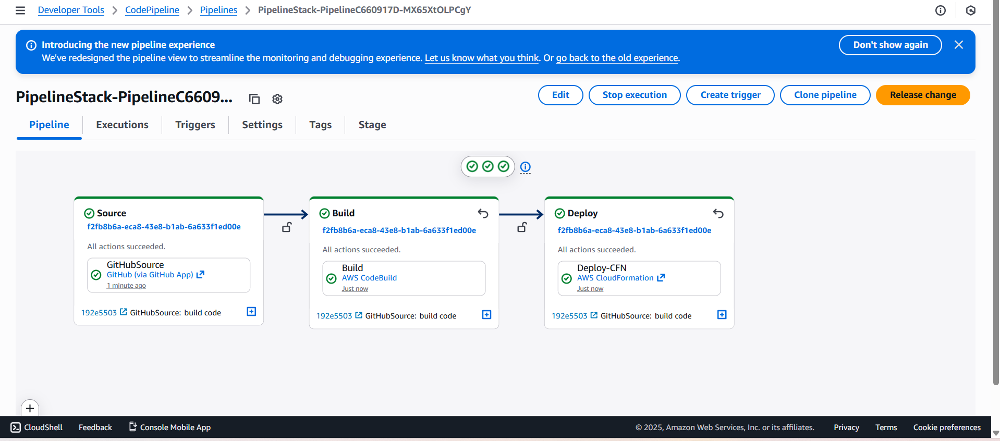
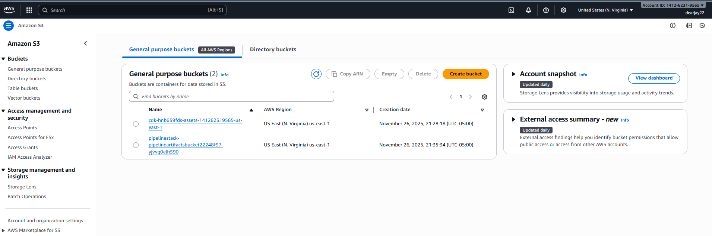
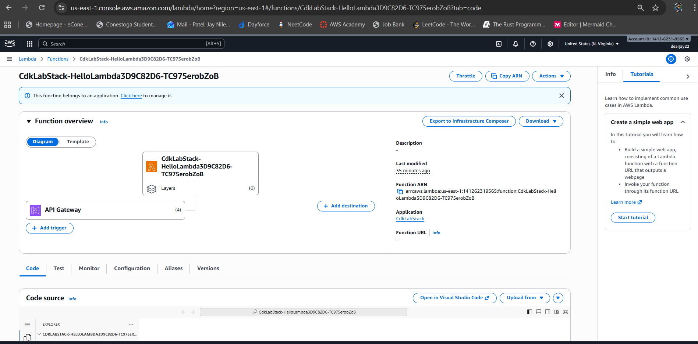
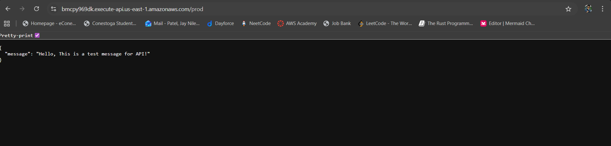
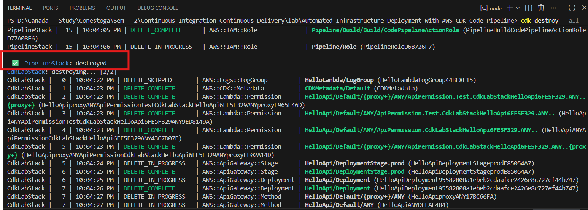
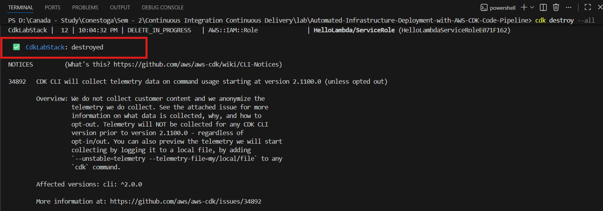

# Automated-Infrastructure-Deployment-with-AWS-CDK-Code-Pipeline

# Explanation of the change you made to trigger a redeployment 

- I have made changes in API to display different message.

# Clean UP

